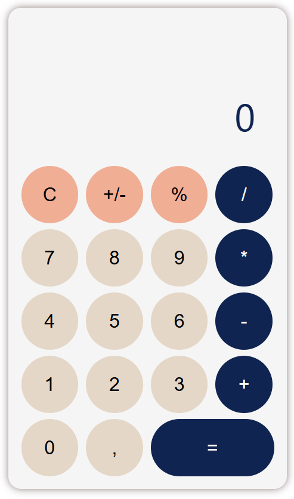

# Calculadora React – Capacita Brasil.

## Sobre o Projeto

Este projeto é uma calculadora web desenvolvida em React como parte do módulo intermediário da oficina Capacita Brasil. Ele exemplifica conceitos práticos de React, boas práticas de desenvolvimento, acessibilidade e experiência do usuário (UX).

## Funcionalidades

- **Operações básicas:**
  - Soma, subtração, multiplicação e divisão.
- **Operações contínuas:**
  - Permite realizar cálculos sequenciais sem a necessidade de pressionar "igual" após cada etapa.
- **Suporte ao teclado físico:**
  - Realize cálculos diretamente pelo teclado, com suporte para números, operadores (+, -, *, /), Enter, Backspace e vírgula decimal.
- **Controle de entrada:**
  - Limite de 10 dígitos no visor.
  - Previne múltiplas vírgulas e zeros à esquerda.
  - Início correto de números decimais.
- **Tratamento de erros:**
  - Divisão por zero exibe uma mensagem de erro e alerta o usuário.
- **Acessibilidade:**
  - Todos os botões e o visor possuem `aria-label` para leitores de tela.
- **UX aprimorada:**
  - Botão "=" com largura maior para facilitar o uso e destacado para melhor visibilidade.
- **Código comentado:**
  - Comentários detalhados no código para facilitar o aprendizado, a manutenção e a personalização.

## Demonstração



## Como usar

### 1. Pré-requisitos

- Node.js (v14 ou superior)
- npm ou yarn

### 2. Instalação

Clone o repositório e instale as dependências:

```bash
git clone https://github.com/daniolivem/calculator-react-capacita.git
cd calculator-react-capacita
npm install
```

### 3. Execução

Para iniciar o projeto, use o comando:

```bash
npm start
```

Em seguida, acesse [http://localhost:3000](http://localhost:3000) no navegador.

## Estrutura do Projeto

```
public/
  calc.png
  ...
src/
  components/
    Calculator.jsx
    Calculator.css
  App.js
  ...
README.md
```

## Tecnologias Utilizadas

- [React](https://reactjs.org/)
- [Material UI](https://mui.com/) (apenas o componente `Container`)
- CSS Grid e Flexbox

## Acessibilidade

- Todos os botões e o visor possuem `aria-label` para suportar leitores de tela.
- Contraste adequado para melhor legibilidade.
- Navegação completa por teclado.

## Personalização

- **Lógica:** Edite o arquivo `src/components/Calculator.jsx` para alterar a funcionalidade.
- **Estilos:** Personalize os estilos no arquivo `src/components/Calculator.css`.

## Créditos

Desenvolvido por [Daniely Mélo](https://www.linkedin.com/in/daniiom).

- [LinkedIn](https://www.linkedin.com/in/daniiom)
- [GitHub](https://github.com/daniolivem)

Projeto criado como parte da oficina Capacita Brasil.

## Licença

Este projeto está sob a licença MIT. Sinta-se à vontade para usar, estudar e modificar!

---

> Dúvidas, sugestões ou feedback? Entre em contato pelo LinkedIn ou abra uma issue no GitHub.

---
